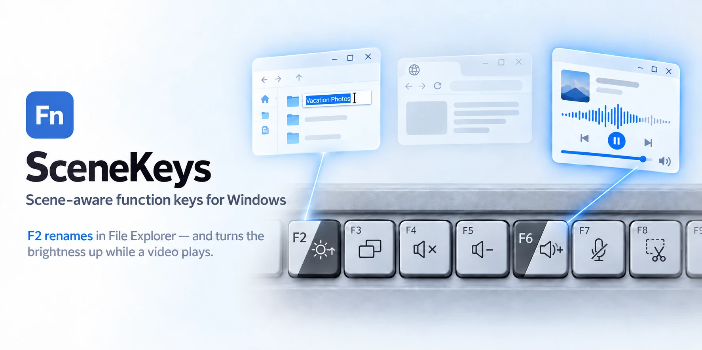

# SceneKeys



**English** · [简体中文](README.zh-CN.md)

**Scene-aware function keys for Windows.** A small tray app that decides what
each of `F1`–`F12` should do *right now*: the shortcut set for the key, or the
standard F-key that the app in front expects.

```
F5 in Chrome                    → F5 (Reload; Chrome uses F5)
F5 in Chrome, video playing     → volume down (the shortcut on F5)
F4 in Chrome                    → mute (Chrome doesn't use F4)
Ctrl+F4, anywhere               → Ctrl+F4 (close tab)
F2 on the desktop               → brightness up (the shortcut on F2)
F2 in a File Explorer window    → F2 (Rename)
```

No driver, no service, no admin rights, and no maker's app needed. One file,
about 200 KB.

> **Status: early.** Version numbers start at 0.9. It works on the machines it
> has been tested on; your keyboard may need setting up by hand.
>
> **Each build runs until a set date** — 30 November 2026 for this one. After
> that it stops changing your F-keys and points you back here for the newer
> version. Nothing breaks: your keys simply behave as ordinary F-keys again, and
> your settings are kept. See [How long a build lasts](#how-long-a-build-lasts).

---

## Download

Downloads are on the [Releases](../../releases) page:

| File | For |
|---|---|
| `SceneKeys-x.y.z-setup.exe` | The usual choice. Installs for your user only, no admin rights. |
| `SceneKeys-x.y.z-portable.zip` | Unzip and run. Keeps its settings next to the exe, writes nothing else. |

**Requirements:** Windows 10 or 11, and .NET Framework 4.8, which is part of
Windows 10 (May 2019 update) and Windows 11.

Windows may warn that the publisher is unknown, because the downloads are not
signed with a paid certificate yet. See [Is it safe?](#is-it-safe) below.

---

## How long a build lasts

SceneKeys is early, and changing fast, so each build has a date written into it
and stops changing keys after it. This one runs until **30 November 2026**.

- **For the last two weeks**, Settings shows a line saying when it stops, and
  the notification area says so once a day. Both link back to this page.
- **From that day**, `F1`–`F12` go back to being ordinary F-keys. SceneKeys
  keeps running with a grey icon, your settings are untouched, and it offers to
  open this page once each time it starts.
- **Downloading the newer version** picks up your settings exactly as they were.

There is no licence check, no account and no phone-home: the date is simply
built into the program, which is why SceneKeys can say it makes no network
connections at all. It stays free.

---

## What it does

Every F-key press is decided by five rules, checked in order. The first one
that applies decides:

| # | When | The key gives |
|---|---|---|
| 1 | Ctrl, Alt, Shift or Win is held | the standard F-key |
| 2 | the key has no shortcut set | the standard F-key |
| 3 | the app in front is **playing**, and the key's shortcut is a playback one | its shortcut |
| 4 | the app in front **uses** this F-key | the standard F-key |
| 5 | anything else | its shortcut |

So the volume and brightness keys work the way they're printed, while `F2` in
File Explorer still renames and `F5` in Chrome still reloads. Nothing to learn
and nothing to hold down.

**Playback shortcuts** are brightness, volume, mute, mic mute and previous,
play/pause and next track. Only these win over an app's own keys while it
plays, so `F11` still makes a video fullscreen instead of taking a screenshot.
They also win over a shortcut you gave that app alone: with `F6` set to
`Ctrl`+`D` in Chrome, `F6` is still volume up while a video plays.

**"Playing"** comes from Windows' own media controls, the same place the volume
flyout's play/pause panel gets it. A paused video isn't playing, and a
notification sound doesn't count.

---

## Setting it up

SceneKeys asks the first time it runs, and whenever a keyboard it doesn't know
connects. It says which keyboard it is setting up, then takes two steps:

1. **Press `F5` three times.** This checks the keyboard sends F-keys first
   (Fn Lock on most laptops); setup goes on only once it does.
2. **Say what's printed on each key**, by hand or from a preset you choose.
   SceneKeys never picks a preset for you from the keyboard's name.

**Keyboards checked on real hardware:** Huawei MateBook X, Logitech K780,
Logitech MX Keys Mini. **From the maker's documentation:** Lenovo ThinkPad X1
Carbon Gen 12, ThinkPads from 2017, Apple Magic Keyboard. Anything else is set
up by hand, which takes a minute. No preset is a guess.

**Keys the keyboard does itself** — keyboard backlight, Wi-Fi, Easy-Switch, the
maker's own app, or anything else you name — can be marked as printed on the
key. SceneKeys can't do those, and says so: pressed alone the key sends its
F-key, and with Fn held the keyboard does what's printed.

**Any key can have any shortcut:** volume and media, brightness, project,
Task View, show desktop, lock, screen snip, voice typing, emoji, copy/paste,
undo/redo, find, zoom, browser back/forward, Insert, Delete, Home, End, and
about 55 more — or any key combination you press into the recorder, such as
`Ctrl`+`Shift`+`T`, or **open an app** of your choosing, such as the maker's
own (Huawei PC Manager, Lenovo Vantage).

**Per app, per key:** each app gets a row where every F-key is one of three
things: the keyboard's shortcut, the app's own F-key named for what it does
there (*Reload* in Chrome, *Rename* in File Explorer, *Save As* in Word), or a
shortcut you give that app alone — handy when one app's F-key is wasted on you.
SceneKeys knows the F-keys of about 50 common apps and keeps them for those
apps with nothing to set up, even ones already open when SceneKeys starts. The
desktop has its own row, separate from File Explorer windows, and an app you
don't want listed can be hidden.

**English and Simplified Chinese** (简体中文), chosen in Settings or followed
from Windows. A short guide opens the first time, with its own language switch,
and comes back each start until a keyboard is set up; it's in the tray menu
after that.

**Fn Lock:** set your keyboard to send F-keys first, so SceneKeys sees every
press. On a Logitech keyboard it can do this for you, without Logitech's
software. When a keyboard is in shortcut mode, a small tile says so and how to
change it back.

---

## Is it safe?

SceneKeys watches the F-keys so it can swap them. That is exactly the kind of
thing worth being careful about, so here is what it does and doesn't do.

**It does not record what you type.** It uses a Windows keyboard hook, but it
only ever looks at `F1`–`F12` and the Ctrl/Alt/Shift/Win keys, to know whether
one is held. Letters, numbers, passwords and everything else pass through
untouched and are never read, stored or counted.

**Nothing leaves your PC.** SceneKeys has no network code at all. It never
connects to anything, sends no statistics, and has no update check. The date a
build stops on is built into it, not checked with a server; opening the download
page only happens when you click the link.

**It stores** one plain text file, `settings.ini`: your keyboards, your
shortcuts, and which F-keys each app uses. Nothing else. You can read it in
Notepad.

**What it needs to know** about the app in front is its program name (such as
`chrome.exe`) and whether it is playing media, which it asks Windows for. It
never reads window contents, page titles, documents or audio.

**No admin rights**, no driver, no service, no scheduled task.

**Why the "unknown publisher" warning?** A code-signing certificate costs money
every year, and the project hasn't bought one yet. You can check any download
against the SHA-256 checksums listed on the release page. If your antivirus
flags it, that is a false positive caused by the keyboard hook; please
[open an issue](../../issues) and say which product reported it.

---

## Questions

**Does it work with any keyboard?** Yes. Choose a preset if yours is in the
list; any other keyboard is set up by hand, one key at a time.

**Does it change my keyboard's firmware?** Only for Logitech keyboards that
store their F-row mode, and only when you turn that option on. It sends the
same setting Logitech's own software sends.

**What about the brightness keys on my laptop?** On many laptops those are
handled inside the keyboard itself and never reach Windows, so no program can
change them. SceneKeys says so rather than pretending otherwise.

**Does it slow anything down?** No. It only wakes up when an F-key is pressed
or the window in front changes.

**Can I take it with me?** Yes, that is the portable download. It keeps its
settings next to the exe and writes nothing to the registry.

---

## Reporting a problem or asking for a keyboard

[Open an issue](../../issues). The templates ask for what's needed: your
keyboard, the app, and what you expected. Layouts for new keyboards are
welcome, as long as you can check them on the real keyboard.

---

## About the source

The source isn't published yet, and no licence has been chosen. Please don't
take the absence of a licence as permission; for now the downloads are free to
use for yourself, and everything else is undecided rather than refused.
