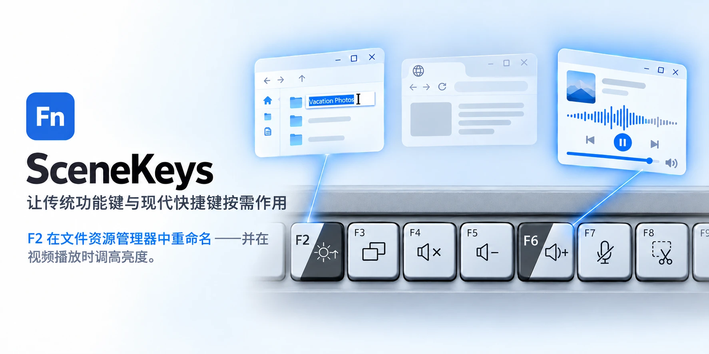

# SceneKeys



[English](README.md) · **简体中文**

**让传统功能键与现代快捷键按需作用。** SceneKeys 是一个 Windows 通知区域小工具，
它会替你判断 `F1`–`F12` 此刻该做什么：是执行你设置的快捷功能，还是保留当前应用
需要的标准 F 键。

```
在 Chrome 中按 F5               → F5（刷新；Chrome 使用 F5）
播放视频时在 Chrome 中按 F5     → 降低音量（F5 上的快捷功能）
在 Chrome 中按 F4               → 静音（Chrome 不使用 F4）
在任何位置按 Ctrl+F4            → Ctrl+F4（关闭标签页）
在桌面按 F2                     → 提高亮度（F2 上的快捷功能）
在文件资源管理器窗口中按 F2     → F2（重命名）
```

不需要驱动、不需要后台服务、不需要管理员权限，也不需要厂商自带的软件。
单个文件，约 200 KB。

> **目前仍是早期版本。** 版本号从 0.9 开始。它在已测试过的机器上可以正常工作，
> 你的键盘可能需要手动设置一次。
>
> **每个版本都有使用期限** —— 本版本为 2026 年 11 月 30 日。到期后它不再改变
> F 键，并提示你回到这个页面获取新版本。不会有任何东西损坏：按键恢复为普通
> F 键，你的设置也会保留。详见[每个版本的有效期](#每个版本的有效期)。

---

## 下载

下载文件都在 [Releases](../../releases) 页面：

| 文件 | 适用情况 |
|---|---|
| `SceneKeys-x.y.z-setup.exe` | 通常选这个。只为当前用户安装，不需要管理员权限。 |
| `SceneKeys-x.y.z-portable.zip` | 解压即用。设置保存在 exe 旁边，不写入其他位置。 |

**系统要求：** Windows 10 或 11，以及 .NET Framework 4.8（Windows 10 2019 年 5 月
更新及 Windows 11 均已自带）。

Windows 可能提示发布者未知，因为这些文件尚未使用付费证书签名，详见
[安全吗？](#安全吗)。

> 中国大陆访问 GitHub 有时并不稳定，尤其是下载 Release 文件。国内镜像正在计划中；
> 在那之前，如果下载失败，请换个时间或网络再试。

---

## 每个版本的有效期

SceneKeys 还很年轻，改动也快，因此每个版本都写入了一个日期，过了这个日期就不再
改变按键。本版本可用到 **2026 年 11 月 30 日**。

- **最后两周**，设置窗口顶部会显示到期日期，通知区域每天提示一次，两处都可以直接
  打开这个页面。
- **到期当天起**，`F1`–`F12` 恢复为普通 F 键。SceneKeys 仍在运行（图标变灰），你的
  设置原样保留，每次启动时会询问是否打开下载页面。
- **下载新版本后**，你原来的设置会被直接沿用。

这里没有授权验证、没有账号，也不会联网检查：日期就写在程序里。这也是 SceneKeys
能够说自己完全不联网的原因。它会一直免费。

---

## 它是怎么判断的

每次按下 F 键，都会按顺序检查五条规则，第一条成立的规则决定结果：

| # | 什么情况 | 这个键的行为 |
|---|---|---|
| 1 | 按住了 Ctrl、Alt、Shift 或 Win | 标准 F 键 |
| 2 | 这个键没有设置快捷功能 | 标准 F 键 |
| 3 | 当前应用**正在播放**，且这个键的快捷功能属于播放类 | 它的快捷功能 |
| 4 | 当前应用**使用**这个 F 键 | 标准 F 键 |
| 5 | 其他情况 | 它的快捷功能 |

所以音量和亮度键会按照键面上印的方式工作，而文件资源管理器里的 `F2` 依然重命名，
Chrome 里的 `F5` 依然刷新。不用记新规则，也不用一直按住某个键。

**播放类快捷功能**包括亮度、音量、静音、麦克风静音，以及上一曲、播放/暂停和下一曲。
只有这些会在播放时盖过应用自己的按键，所以 `F11` 仍然让视频全屏，而不是去截图。
它们也会盖过你单独给该应用设置的快捷功能：即使在 Chrome 中把 `F6` 设成了
`Ctrl`+`D`，播放视频时 `F6` 仍然是提高音量。

**“正在播放”**来自 Windows 自己的媒体控制，和音量面板里的播放/暂停用的是同一个来源。
暂停的视频不算在播放，一声通知音也不算。

---

## 如何设置

首次运行时 SceneKeys 会主动询问，之后每当连接到它不认识的键盘时也会询问。它会先
说明正在设置的是哪个键盘，然后分两步：

1. **连续按三次 `F5`。** 以确认键盘优先发送 F 键（多数笔记本是 Fn 锁定），确认之后
   才能继续。
2. **说明每个键上印着什么**，可以手动设置，也可以选择一个预设。SceneKeys 不会根据
   键盘名称替你猜预设。

**33 款键盘的预设**，按厂商列出，并画出每个预设的按键，方便选择前与你的键盘对照：

- **笔记本：** 戴尔 XPS、Latitude、Precision · 联想 ThinkPad、IdeaPad、ThinkBook ·
  惠普 EliteBook、ProBook · 华硕 ExpertBook、Zenbook、Vivobook · 华为 MateBook ·
  荣耀 MagicBook · 三星 Galaxy Book · 微软 Surface Laptop
- **键盘：** 罗技 MX Keys、MX Keys S、MX Keys Mini、K380、Pebble Keys 2、K780、
  Signature K650 和 K950、Wave Keys、ERGO K860 · 微软蓝牙键盘、Designer Compact 和
  Surface 键盘 · Apple 妙控键盘 · Keychron K 系列

每个预设都来自厂商标明 F 键编号的手册或图片，或来自真实的键盘。少数无法这样核对的，
选择时会注明。其他键盘手动设置一次即可，大约一分钟。

**键盘自己完成的功能** —— 键盘背光、Wi-Fi、Easy-Switch、厂商自己的应用，或者你
自己命名的其他功能 —— 可以标记为“键上印的功能”。SceneKeys 做不了这些，也会如实
说明：单独按这个键时发送它的 F 键，按住 Fn 再按则由键盘完成键上印的功能。

**任何键都可以设置成任何快捷功能：** 音量与媒体、亮度、投影、任务视图、显示桌面、
锁定、截图、语音输入、表情面板、复制/粘贴、撤销/重做、查找、缩放、浏览器前进后退、
Insert、Delete、Home、End 等约 55 项 —— 也可以录制任意组合键，例如
`Ctrl`+`Shift`+`T`，或者**打开一个你选择的应用**，例如厂商自己的应用（华为电脑管家、
Lenovo Vantage）。

**逐应用、逐键选择：** 每个应用占一行，行中的每个键有三种选择：使用键盘的快捷功能、
使用应用本身对该键的功能（在 Chrome 中是*刷新*，在文件资源管理器中是*重命名*，在
Word 中是*另存为*），或者只给这个应用单独设置一个快捷功能 —— 当某个应用白白占用了
一个 F 键时很有用。SceneKeys 内置了约 55 个常用应用的 F 键功能（包括 Everything，
以及 Total Commander、Directory Opus、XYplorer、FreeCommander 等文件管理器），并会
自动为这些应用保留，无需任何设置，即使应用在 SceneKeys 启动前就已打开。桌面有单独的一行，与文件
资源管理器窗口分开；不想看到的应用可以隐藏。

**中英文界面**（简体中文 / English），可在设置中选择，也可以跟随 Windows。首次运行
会打开一份简短的使用指南，指南里也可以切换语言；在设置好键盘之前，每次启动都会再次
打开它，之后可以从通知区域菜单随时打开。

**Fn 锁定：** 请让键盘优先发送 F 键，这样 SceneKeys 才能看到每一次按键。罗技键盘
可以由它代为切换，不需要装罗技的软件。当键盘处于快捷功能键模式时，屏幕角落会出现
一个小提示，说明如何切回去。

---

## 安全吗？

SceneKeys 需要盯着 F 键才能替换它们。这正是值得小心的地方，所以下面写清楚它做了
什么、没做什么。

**它不记录你输入的内容。** 它使用 Windows 的键盘挂钩，但只查看 `F1`–`F12`，以及
Ctrl/Alt/Shift/Win 是否被按住。字母、数字、密码和其他一切都原样通过，不会被读取、
保存或统计。

**没有任何数据离开你的电脑。** SceneKeys 完全没有联网代码。它不连接任何服务器，
不发送统计信息，也没有更新检查。版本的到期日期写在程序里，不向服务器查询；只有你
点击链接时才会打开下载页面。

**它只保存一个纯文本文件** `settings.ini`：你的键盘、快捷功能，以及每个应用使用哪些
F 键。除此之外没有别的。你可以用记事本直接打开查看。

**关于当前应用**，它向 Windows 询问的只有程序名（例如 `chrome.exe`）和是否正在播放
媒体。它不读取窗口内容、网页标题、文档或音频。

**不需要管理员权限**，没有驱动、没有服务、没有计划任务。

**为什么会提示“未知发布者”？** 代码签名证书每年都要花钱，这个项目还没有购买。你
可以用 Release 页面上的 SHA-256 校验值核对下载的文件。如果杀毒软件报警，那是键盘
挂钩引起的误报，欢迎[提交 issue](../../issues) 并说明是哪个产品报的。

---

## 常见问题

**任何键盘都能用吗？** 可以。列表里有你的键盘就选择对应的预设；其他键盘手动逐键设置一次即可。

**它会改动键盘固件吗？** 只有罗技那些自己记住功能键模式的键盘，而且只在你打开该
选项时。它发送的就是罗技自家软件发送的那个设置。

**笔记本上的亮度键怎么办？** 很多笔记本的亮度键由键盘自己处理，根本不会传到
Windows，任何程序都改不了。SceneKeys 会直说，而不是假装能做到。

**会让电脑变慢吗？** 不会。只有在按下 F 键或切换窗口时它才会工作一下。

**可以随身携带吗？** 可以，这就是便携版。它把设置保存在 exe 旁边，不写注册表。

---

## 反馈问题或申请键盘布局

请[提交 issue](../../issues)。模板里会问到必要的信息：你的键盘、应用，以及你期待的
结果。也欢迎提供新键盘的布局，前提是你能在真机上逐键核对。

---

## 关于源代码

源代码尚未公开，许可协议也还没有确定。请不要把“没有许可协议”理解为默认授权；目前
这些下载文件可以免费自用，其余部分只是尚未决定，而不是拒绝。
